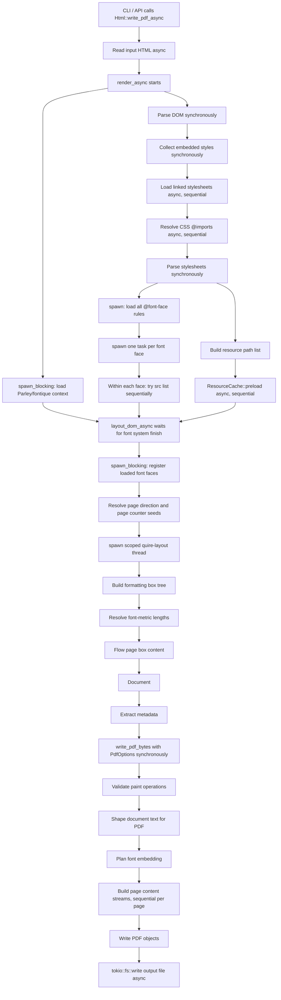
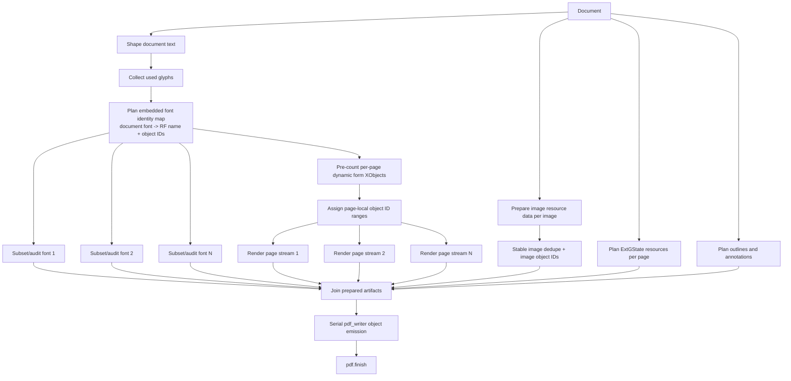

# Concurrency and Parallelism

This document tracks where Quire currently uses async/concurrent execution, and
where the rendering and PDF output pipelines can safely gain parallelism later.
It is intentionally a working design note: add new sections as the architecture
changes or as profiling identifies better targets.

## Current Rendering Pipeline

Production async usage is currently concentrated in resource loading, HTML
orchestration, font loading, and one layout worker thread.

- The CLI runs on Tokio via `#[tokio::main]` in `src/main.rs`.
- `Html::from_file_async`, `Html::from_url_async`, `Html::render_async`, and
  `Html::write_pdf_async` orchestrate the async public pipeline in
  `src/html.rs`.
- CSS file and `@import` loading are async in `src/css/types/source.rs`, but
  imports are resolved depth-first and sequentially.
- Resource reads use `reqwest` for HTTP(S) URLs and `tokio::fs::read` for
  local `file:` URLs in `src/resource.rs`.
- Font loading starts the Parley/fontique context on `spawn_blocking`, loads
  `@font-face` rules with Tokio tasks, and registers loaded font faces on
  `spawn_blocking` in `src/text/system/font_loading.rs`.
- Layout waits for font loading, then runs the page-box build and flow on one
  scoped `quire-layout` thread with a larger stack in `src/layout/split_1.rs`.
- PDF serialization is synchronous once a `Document` exists; only the final file
  write in `Html::write_pdf_async` uses `tokio::fs::write`.

Important current sequential points:

- linked stylesheets load one by one;
- stylesheet imports load one by one;
- `ResourceCache::preload` reads one resource at a time;
- layout, cascade-dependent box construction, page flow, and fragmentation are
  effectively serial;
- PDF object emission through `pdf_writer::Pdf` is serial.

## PDF Output Opportunities

The PDF writer currently performs most work serially in `src/pdf/writer.rs`:

1. shape document text for PDF;
2. collect used glyphs and build embedded font plans;
3. deduplicate images;
4. build page content streams;
5. collect page graphics-state resources;
6. plan annotations and outlines;
7. write PDF objects into one `pdf_writer::Pdf`.

Font subsetting is one of the best near-term concurrency targets. The current
font planning step combines cheap global planning with expensive per-font work:
collecting used glyphs, deduplicating document fonts, assigning resource names,
auditing font programs, subsetting font files, building descriptor metrics,
building ToUnicode data, and optionally building PDF/A CIDSet data.

Page content rendering needs the PDF font resource mapping, not the subset font
bytes. Text content in `src/pdf/content.rs` maps `document_font_id` to an
embedded font resource name such as `RF1`; it does not need the final embedded
font stream. That means font planning can be split:

1. collect used glyphs and deduplicate document fonts;
2. assign stable embedded font indexes, resource names, and object IDs;
3. run heavy per-font audit/subsetting concurrently.

After step 2, page content stream generation can run while font files are being
subset.

Good PDF-side candidates for parallel work:

- audit and subset each unique embedded font independently;
- generate page content streams independently after stable font resource names
  and object ID ranges are known;
- prepare image resource data, especially cropped image RGB/alpha buffers, then
  perform stable deduplication;
- collect page-local ExtGState resources per page;
- shape PDF text per page, although this is mostly copying already-shaped
  layout glyph data today.

Work that should probably remain serial or have a serial planning phase:

- global object ID allocation;
- stable font and image resource naming;
- outline object ID planning;
- final mutation of `pdf_writer::Pdf`;
- final deterministic file identifier hashing.

## Open Questions

- Should Quire use Tokio tasks, scoped threads, or a CPU pool for CPU-bound PDF
  work? Tokio is already present for async I/O, but font subsetting and page
  stream generation are CPU work.
- Can page content rendering be split into a pure pre-count pass and a render
  pass without duplicating too much paint-tree traversal logic?
- Should image deduplication hash cropped image data after parallel preparation,
  or should we introduce a cheaper structural key before materializing cropped
  buffers?
- How much determinism do we require from log ordering and warning ordering when
  font audits run in parallel?

## Future Notes

Add profiling results, implementation sketches, and rejected approaches here as
parallelism work lands.
